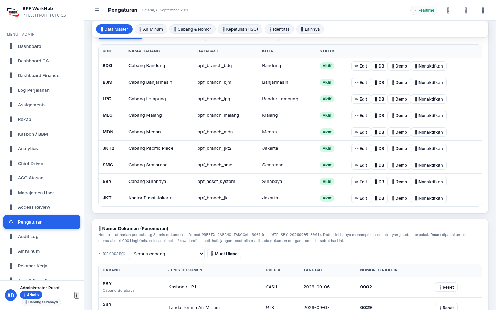
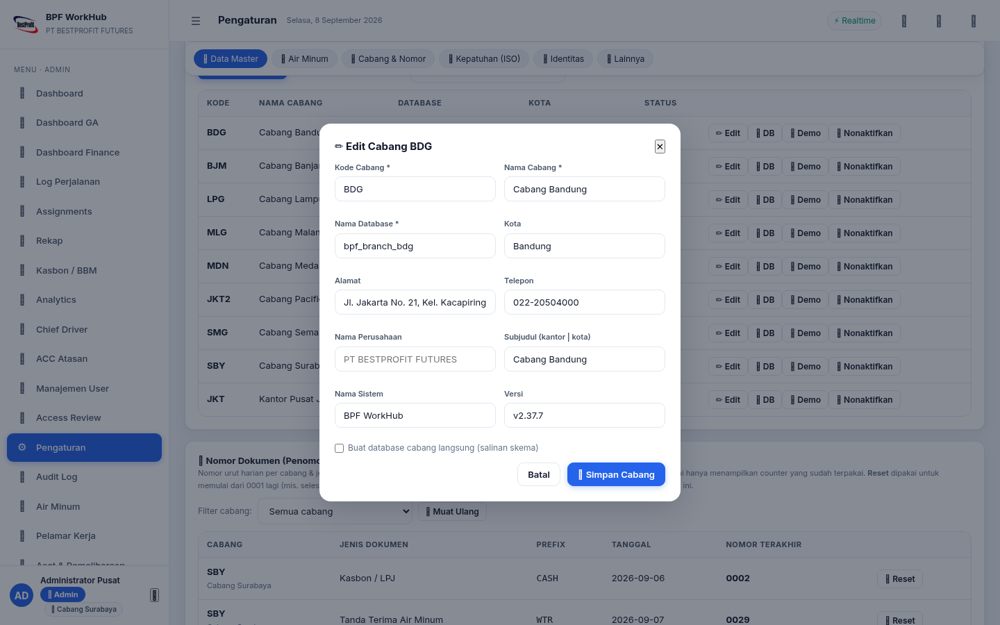
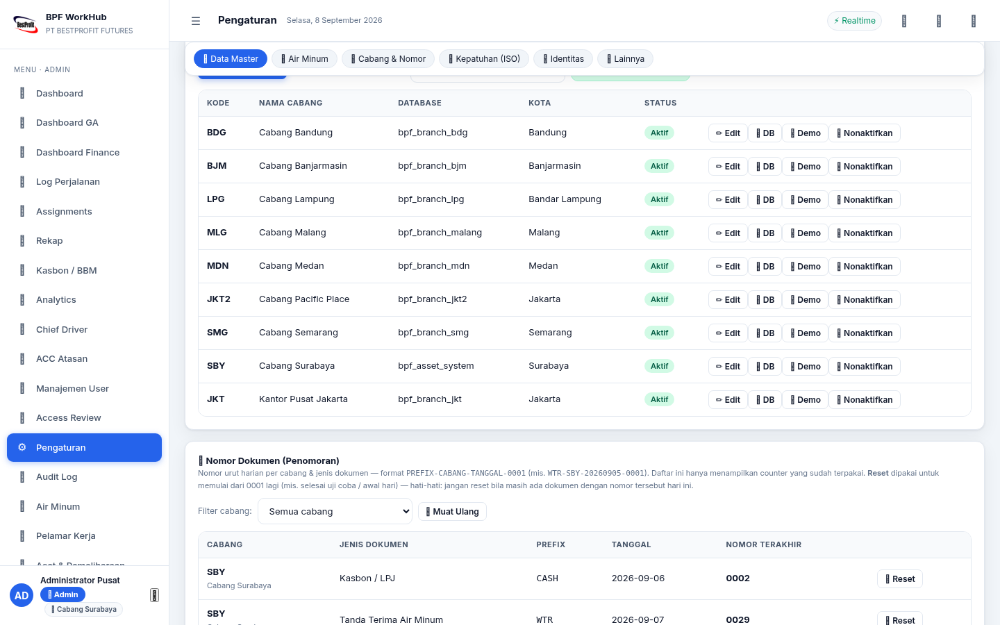

# 📖 Panduan Pengguna BPF WorkHub v2.41.2

> **Siapa pun kamu — sopir, OB, admin, atau pimpinan — panduan ini ditulis untuk kamu.**
> Tidak perlu paham teknis. Cukup ikuti langkah-langkah sesuai bagianmu.
>
> **PT. Bestprofit Futures — Kantor Pusat Jakarta** (Equity Tower, SCBD Lot 9, Jl. Jend. Sudirman Kav. 52-53, Jakarta Selatan)
>
> 🗺️ *Dokumen pendamping: [Lembar Latihan per Peran](../docs/public/PELATIHAN.md) untuk berlatih mandiri, dan [Ringkasan Satu Halaman](../docs/public/ONEPAGER.md) untuk gambaran cepat sistem.*

---

## Daftar Isi

1. [Selamat Datang](#1-selamat-datang)
2. [Cara Masuk (Login)](#2-cara-masuk-login)
3. [Untuk OB — Pembelian Air Minum 💧](#3-untuk-ob--pembelian-air-minum)
4. [Untuk Driver — BBM & Perjalanan 🚗](#4-untuk-driver--bbm--perjalanan)
5. [Untuk GA — Verifikasi & Pengawasan 🧾](#5-untuk-ga--verifikasi--pengawasan)
6. [Untuk Finance — Pembayaran & Rekap 💰](#6-untuk-finance--pembayaran--rekap)
7. [Untuk Marketing — Jadwal Appointment 📣](#7-untuk-marketing--jadwal-appointment)
8. [Untuk Chief Driver — Pembagian Tugas 🚛](#8-untuk-chief-driver--pembagian-tugas)
9. [Untuk Receptionist — Pelamar Kerja 🪪](#9-untuk-receptionist--pelamar-kerja)
10. [Untuk Traineer / Upline — Pantau Rekrutan 🎯](#10-untuk-traineer--upline--pantau-rekrutan)
11. [Untuk GA — Aset & Pemeliharaan 🔧](#11-untuk-ga--aset--pemeliharaan)
    - [11.5 Untuk GA HR — Data Overtime ⏰](#115-untuk-ga-hr--data-overtime-)
    - [11.6 Migrasi Data dari Google Sheet 📥](#116-untuk-ga-hr--migrasi-data-driver-dari-google-sheet-)
12. [Untuk Admin — Pengaturan Sistem ⚙️](#12-untuk-admin--pengaturan-sistem)
    - [12.6 Verifikasi PIN Ulang (Step-up Auth) 🔑](#126-verifikasi-pin-ulang-step-up-auth-)
    - [12.7 Access Review (Admin) 🛂](#127-access-review-admin-)
    - [12.8 Retensi & Arsip Dokumen (Admin) 🗄️](#128-retensi--arsip-dokumen-admin-)
    - [12.9 Verifikasi & Registri Dokumen (Admin) 🔏](#129-verifikasi--registri-dokumen-admin-)
    - [12.10 ACC Berjenjang — Persetujuan Atasan ✅](#1210-acc-berjenjang--persetujuan-atasan--sejak-v2360)
    - [12.11 Sumber Sheet Receptionist & Bridge Apps Script 🔗](#1211-sumber-sheet-receptionist--bridge-apps-script-)
13. [Kasbon: Alur Lengkap dari A sampai Z](#13-kasbon-alur-lengkap-dari-a-sampai-z)
14. [Untuk IT — News Scraper & Content Management 📰](#14-untuk-it-sebagai-cabang--news-scraper--content-management-)
15. [Mengatasi Masalah (Troubleshooting)](#15-mengatasi-masalah-troubleshooting)
16. [Istilah-istilah Penting](#16-istilah-istilah-penting)

---

## 1. Selamat Datang

Aplikasi ini adalah **satu tempat untuk semua urusan armada dan kantor**:

- **Driver** mencatat pembelian BBM, mengajukan kasbon (uang muka), dan melaporkan perjalanan.
- **OB** mengajukan pembelian air minum galon/botol/gelas.
- **GA, Finance, Marketing, Chief Driver, dan Admin** memverifikasi, menyetujui, dan mengelola semuanya dari dashboard masing-masing.

Setiap orang **hanya melihat menu sesuai tugasnya**. Tidak ada yang tercampur — tiap bagian punya halaman sendiri (prinsip *least privilege*: akses seminimal mungkin).

> 💡 Aplikasi bisa dibuka dari **komputer, laptop, atau HP** — cukup pakai browser.

---

## 2. Cara Masuk (Login)

### 2.1 Halaman Login

1. Buka alamat aplikasi (tanyakan ke Admin jika belum tahu).
2. Halaman **Login** akan muncul.
3. Isi **Username** dan **PIN 6 digit** milikmu.
4. Klik **🔐 Masuk**.

Setelah masuk, kamu otomatis diarahkan ke halaman utama sesuai peranmu:

| Peran | Contoh Username | Langsung dibawa ke |
|-------|----------------|--------------------|
| Admin | `admin` | Dashboard Admin |
| GA | `ga_sby`, `ga_hu`, ... | Dashboard GA |
| Finance | `finance_sby`, `finance_hu`, ... | Dashboard Finance |
| GA HR | `gahr_sby`, `gahr_hu`, ... | Data Overtime |
| Marketing | `marketing_sby`, `marketing_hu`, ... | Marketing Hub |
| Chief Driver | `chief_driver` | Dashboard Chief Driver |
| Driver | `driver_1`, `driver_2`, ... | Aplikasi Driver |
| OB | `ob` | Halaman Air Minum |
| Security | `security_sby`, `security_budi_sby`, ... | Overtime Saya |
| IT | `it_sby`, `it_hu`, ... | News Scraper |

### 2.2 Keluar dari Aplikasi

Klik tombol **🚪 Keluar** di pojok kanan atas. Selalu keluar jika memakai komputer bersama agar data tetap aman.

### 2.3 Kalau Lupa PIN?

Mintalah **Admin** untuk mereset PIN-mu (dari halaman Manajemen User). Jangan berbagi PIN dengan siapa pun — PIN adalah tanda tangan digitalmu.

> 🔑 **Saran:** segera ganti PIN setelah pertama kali masuk. PIN awal semua akun biasanya `123456`.

### 2.4 Memasang di Layar Utama HP (Opsional)

1. Buka aplikasi di browser HP (Chrome).
2. Ketuk ikon **⋮** (titik tiga) di pojok kanan atas.
3. Pilih **"Tambahkan ke Layar Utama"** (Add to Home Screen).
4. Aplikasi tampil seperti aplikasi biasa di HP-mu — bisa dibuka sekali sentuh. 📱

---

## 3. Untuk OB — Pembelian Air Minum 💧

> **Kamu adalah OB (Office Boy).** Tugasmu: mencatat pembelian air minum dan mengunggah bukti fotonya. Bagian yang lain (jenis, merek, verifikasi) sudah diurus Finance & GA — kamu tinggal mengisi form.

### 3.1 Yang Kamu Lihat

Setelah login, kamu langsung berada di **Halaman Air Minum**. Di sana ada form pengajuan dan daftar pengajuanmu.

### 3.2 Mengajukan Pembelian Air Minum (Langkah demi Langkah)

1. Isi **Tanggal** pembelian.
2. Isi **Jumlah yang dibeli** (berapa galon/botol/gelas).
3. Pilih **Jenis air minum** — pilihannya: **Gelas, Botol, atau Galon** (disediakan Finance).
4. Pilih **Merk** dari daftar (misalnya AQUA Galon, Le Minerale, dll).
5. **Unggah foto bukti** — dua foto wajib:
   - 📸 **Foto sebelum diisi** (kondisi galon kosong / sebelum isi ulang)
   - 📸 **Foto sesudah diisi** (galon sudah terpasang/penuh)
6. Klik **Kirim**.

Pengajuanmu akan muncul di daftar dengan status **"Menunggu Verifikasi"**.

> ⚠️ **Foto wajib.** Pengajuan tanpa foto bukti tidak bisa diproses. Foto juga harus jelas menunjukkan waktu (time stamp) — inilah bukti bahwa air benar-benar dibeli.

### 3.3 Setelah Kamu Mengirim

- **Finance** akan memeriksa dan memverifikasi pengajuanmu (bisa menambah catatan).
- Jika disetujui, akan terbit **PDF tanda terima** yang ditandatangani Finance (penyerah) dan GA (penerima).
- Jika ditolak, lihat alasan penolakan dan perbaiki pengajuannya.

### 3.4 Status yang Mungkin Kamu Lihat

| Status | Artinya |
|--------|---------|
| Menunggu Verifikasi | Sudah dikirim, sedang diperiksa Finance |
| Terverifikasi | Disetujui — nanti terbit tanda terima PDF |
| Ditolak | Ada yang kurang — perbaiki sesuai alasan |

> 💡 Semua pengajuanmu **hanya terlihat olehmu, Finance, dan Admin**. OB lain tidak bisa melihat pengajuanmu.

### 3.5 Catat Overtime Kamu ⏰ (v2.39)

Selain air minum, kamu (dan user **Security**) punya menu **⏰ Overtime Saya**
di sidebar untuk mencatat lembur sendiri:

1. Klik menu **⏰ Overtime Saya**.
2. **Nama & Posisi sudah terisi otomatis** dari akunmu (tidak bisa diubah —
   mencegah pengisian atas nama orang lain).
3. Isi **Tanggal**, **Waktu Mulai**, **Waktu Selesai**, dan **Keterangan** —
   kolom yang sama dengan di Google Sheet sumber data.
4. (Disarankan) Ambil **foto bukti** mulai & selesai — otomatis diberi
   watermark perusahaan + tanggal + GPS.
5. Klik **Kirim Overtime** → simpan nomor bukti `OTL-…`.
6. Riwayat lemburmu tampil di sisi kanan halaman (terbaru di atas).

> Pengajuanmu diteruskan ke **GA HR** untuk di-ACC lalu **Admin** — sama
> seperti overtime Driver. Cek status di riwayat atau tanya GA HR.
>
> ⏱️ **Batas waktu submit (v2.40.0):** kirim sebelum melewati batas yang
> ditetapkan perusahaan (default **24 jam** sejak jam selesai lembur).
> Kalau terlambat, pengajuanmu **tetap diterima** tapi diberi tanda
> **⏳ Terlambat** di riwayat dan daftar GA HR — jadi jangan kaget bila
> ditanya alasannya.
>
> 📸 **Foto bukti tampil resmi:** foto mulai & selesai bisa dibuka langsung
> dari daftar (preview), dan ikut **tercetak di Formulir Permohonan
> Overtime PDF** — bukti lembur lengkap tanpa Google Form.

---

## 4. Untuk Driver — BBM & Perjalanan 🚗

> **Kamu adalah Driver.** Tiga hal utama: (1) melaporkan pembelian BBM, (2) mengajukan kasbon, (3) mencatat log perjalanan. Semuanya dari satu aplikasi yang ramah HP.

### 4.1 Halaman Driver

Buka halaman Driver (bisa dipasang di HP). **Login dengan Username & PIN** yang diberikan Admin. Ada 4 tab: **⛽ BBM**, **💰 Kasbon**, **🗺️ Trip**, **📊 Rapor**.

### 4.2 Melaporkan Pembelian BBM (Bayar Dulu, Klaim Belakangan)

1. Buka tab **⛽ BBM**.
2. **GPS otomatis aktif** — lokasi + alamat detail terdeteksi.
3. Isi data pembelian: **jenis BBM**, **liter**, **harga per liter**, **nominal**, **SPBU**.
4. **Ambil foto** — pilih **📷 Kamera** (ambil langsung) atau **🖼️ Galeri** (dari album foto).
5. Foto otomatis diberi **watermark** (nama perusahaan + tanggal + lokasi GPS + koordinat).
6. Klik **Kirim**.

Klaimmu masuk antrean **GA** untuk disetujui, lalu **Finance** untuk dibayar. Statusnya bisa kamu pantau di daftar riwayat.

### 4.3 Mengajukan Kasbon (Uang Muka Sebelum Berangkat)

1. Buka tab **💰 Kasbon**.
2. Isi **nominal dasar** yang kamu butuhkan. Sistem otomatis menambahkan **kode unik** (angka receh, misal Rp 100.000 + kode) supaya pembayaranmu bisa dicocokkan.
3. Klik **💰 Ajukan Kasbon**.

Alur lengkapnya ada di [Bagian 10](#10-kasbon-alur-lengkap-dari-a-sampai-z).

### 4.4 Mencatat Log Perjalanan (Trip)

1. Buka tab **🗺️ Trip**.
2. Isi **tujuan perjalanan, lokasi berangkat, lokasi tujuan, dan KM awal**.
3. Saat sampai, catat **KM akhir** dan klik selesai.

> 💡 **Auto-Save**: setiap perubahan di tab Trip tersimpan otomatis ke HP (IndexedDB). Jika app tertutup atau HP mati, data akan pulih saat dibuka lagi. Draft otomatis terhapus setelah submit berhasil.

> 📍 **Detail GPS**: lokasi otomatis terdeteksi dengan detail lengkap — jalan, kelurahan, kecamatan, kota, provinsi, kode pos, dan SPBU terdekat.

Laporan ini dipakai GA untuk meninjau dan menghitung efisiensi kendaraan.

### 4.5 Cek Performa Kendaraan (Rapor)

Di tab **📊 Rapor**, masukkan **nomor polisi** kendaraanmu untuk melihat performa bahan bakar (rata-rata km/liter). Statusnya: **HEMAT**, **CUKUP**, atau **BOROS**.

### 4.6 Mode Offline 📡

Pernah di jalan tanpa sinyal? Tenang:

- Data yang kamu isi **tersimpan otomatis di HP**.
- Saat sinyal kembali, aplikasi **mengirim sendiri datanya** ke server.
- Tanda **🟡 Offline** di atas layar berarti datamu belum terkirim. Tekan **🔄 Sinkron** untuk mengirim manual.

### 4.7 Jadwal Appointment Saya

Jika Marketing menjadwalkan kunjungan untukmu, jadwalnya muncul di aplikasi Driver. Setelah kunjungan selesai, isi **hasil kunjungan** — data ini menjadi bahan laporan Marketing.

---

## 5. Untuk GA — Verifikasi & Pengawasan 🧾

> **Kamu adalah GA (General Affairs).** Dashboard-mu adalah pusat kendali: menyetujui klaim BBM, memverifikasi anomali, menyetujui kasbon, dan mengawasi laporan perjalanan.

### 5.1 Dashboard GA

Setelah login, kamu langsung masuk **Dashboard GA** (`/app/ga`). Di sana ada:

- **🕐 Antrean Klaim BBM** — klaim driver yang menunggu persetujuanmu.
- **🛡 Verifikasi Anomali** — klaim ber-tanda ⚠️ yang perlu diperiksa lebih teliti.
- **💵 Kasbon menunggu approve** — jumlah & nominal.
- **🗺️ Laporan perjalanan pending** — laporan yang belum ditinjau.

> ⚡ **Anti-ngoding:** kalau ada klaim baru masuk saat kamu sedang membuka dashboard, antreannya **langsung ter-refresh sendiri**. Tidak perlu muat ulang halaman.

### 5.2 Menyetujui Klaim BBM

1. Di antrean klaim, periksa data klaim & foto bukti.
2. Klik **✅ Approve** — untuk aksi uang (approve/payout/verifikasi), sistem
   meminta **konfirmasi PIN ulang** (lihat [Bagian 12.6](#126-verifikasi-pin-ulang-step-up-auth-🔑)); isi PIN-mu, lalu aksi dilanjutkan otomatis.
3. Klaim berpindah ke antrean Finance untuk pembayaran.

### 5.3 Menolak Klaim

1. Klik **✕ Tolak**.
2. **Alasan penolakan wajib diisi** — ini penting untuk jejak audit.
3. Driver akan melihat alasan tersebut di aplikasinya.

### 5.4 Memverifikasi Klaim Ber-Tanda ⚠️

Klaim dengan tanda ⚠️ (anomali) punya tombol **🛡 Verifikasi** tersendiri. Saat diverifikasi, pastikan bukti (foto, nominal, waktu) benar-benar cocok. Kamu akan diminta konfirmasi sebelum menyetujui.

### 5.5 Menyetujui & Menyerahkan Kasbon

Lihat [Bagian 10](#10-kasbon-alur-lengkap-dari-a-sampai-z) — peranmu ada di langkah **GA: menyetujui & menyerahkan dana**.

### 5.6 Menu Lain yang Bisa Kamu Akses

- **Log Perjalanan** — meninjau laporan trip driver.
- **Assignments** — menugaskan/menukar kendaraan antar driver.
- **Kasbon / BBM** — melihat semua pengajuan.
- **Analytics** — memantau performa armada.

---

## 6. Untuk Finance — Pembayaran & Rekap 💰

> **Kamu adalah Finance.** Tugasmu: membayar klaim, mengatur kode unik kasbon, memverifikasi pembelian air minum, dan menyediakan data (jenis & merk air) untuk OB.

### 6.1 Dashboard Finance

Setelah login, kamu langsung masuk **Dashboard Finance** (`/app/finance`). Di sana ada:

- **💧 Rekap Air Minum** — ringkasan pembelian (total, menunggu verifikasi, terverifikasi, ditolak), **per OB**, **per jenis** (gelas/botol/galon), dan **per merk**.
- **🕐 Antrean Verifikasi** — pengajuan air minum yang menunggu keputusanmu.
- **💵 Kasbon menunggu Finance** — kasbon yang sudah disetujui GA & siap kamu cairkan, plus LPJ yang menunggu.

### 6.2 Memverifikasi Pembelian Air Minum

1. Buka **Antrean Verifikasi** (di dashboard atau halaman Air Minum).
2. Periksa pengajuan OB: tanggal, jumlah, jenis, merk, dan **dua foto bukti** (sebelum & sesudah).
3. Setuju? Isi **remark** (mis. "sesuai struk") dan klik verifikasi.
4. Perlu catatan tambahan? Tulis di kolom **note** — catatanmu ikut tersimpan sebagai jejak audit.
5. Setelah terverifikasi, **PDF tanda terima** otomatis bisa dicetak — ditandatangani **Finance** (yang menyerahkan) dan **GA** (yang menerima).

### 6.3 Menyediakan Jenis & Merk Air Minum

OB memilih jenis & merk dari daftar yang **kamu** kelola:

- Jenis: **Gelas, Botol, Galon**.
- Merk: daftar brand (mis. AQUA Galon, Le Minerale, dll) — bisa ditambah/diubah dari menu yang tersedia.

### 6.4 Rekap & Export

- Filter rekap berdasarkan **tanggal** (secara otomatis menampilkan 90 hari terakhir).
- Klik **⬇️ Export CSV** untuk mengunduh data ke Excel.

### 6.5 Menyetujui Pencairan Kasbon

Lihat [Bagian 10](#10-kasbon-alur-lengkap-dari-a-sampai-z) — peranmu ada di langkah **Finance: menyetujui pencairan**.

### 6.6 Mengedit / Menghapus Transaksi Air Minum ✏️ (sejak v2.37.0, bila diaktifkan Admin)

Ada salah ketik di pengajuan — qty kelebihan, tanggal keliru? Bila Admin
telah **mengaktifkan fitur** ini untuk cabangmu, tombol baru muncul di halaman
Air Minum:

- **✏️ Edit** — koreksi tanggal pengiriman, rincian item (jenis/merk/satuan/qty),
  remark & note. Berlaku untuk pengajuan berstatus **Menunggu** dan
  **Terverifikasi** (yang Ditolak tidak perlu diedit — cukup tolak dengan alasan).
  Foto bukti OB tidak berubah — bukti tetap orisinal.
- **🗑️ Hapus** — menghapus pengajuan **permanen** (termasuk fotonya).
  Sebelum hilang, sistem menyimpan **snapshot lengkap ke Audit Log** — jadi
  tetap ada jejak siapa menghapus apa & kapan.

⚠️ Keduanya meminta **verifikasi PIN** dulu (step-up) dan tercatat penuh di
Audit Log — data lama tersimpan sebagai snapshot. Gunakan untuk koreksi
kecil; jangan untuk mengubah riwayat secara luas.

> Fitur ini **nonaktif secara default**. Admin mengaktifkannya per cabang di
> **Pengaturan → 🚰 Air Minum → ✏️ Edit & Hapus Transaksi** (lihat 12.3).

### 6.7 Menu Lain

- **Rekap** — mencetak rekap & laporan (PDF).
- **Kasbon / BBM**, **Analytics**, **Log Perjalanan**.

---

## 7. Untuk Marketing — Jadwal Appointment 📣

> **Kamu adalah Marketing.** Tugasmu: menjadwalkan kunjungan (appointment) untuk para driver.

### 7.1 Membuat Appointment Baru

1. Buka **Marketing Hub**.
2. Pilih **tanggal** kunjungan dan **sesi** (Sesi 1 pagi / Sesi 2 sore).
3. Isi **Jam Kunjungan** (opsional) — jam spesifik di dalam rentang sesi (mis. 09:15). Kosongkan untuk memakai jam awal sesi otomatis.
4. Isi **nama calon nasabah, nama marketing, dan alamat lengkap**.
5. Simpan. Driver akan menerima jadwalnya di aplikasi.

> 💡 **Jam kunjungan penting!** Chief Driver memakai jam ini untuk menyusun **rute otomatis** — appointment diurutkan sesuai jam dan dibagi per area, sehingga driver tidak bolak-balik.

### 7.2 Memantau & Mengedit

- Semua jadwal tampil di papan **realtime** — perubahan langsung terlihat semua orang yang berhak.
- Bisa **mengedit** (termasuk jam kunjungan) atau **membatalkan** jadwal; statusnya langsung diperbarui (mis. "Selesai dikunjungi").

### 7.3 Hasil Kunjungan = Data Konversimu

Setelah driver mengunjungi lokasi, driver mengisi **hasil kunjungan**. Data ini menjadi laporan konversi untukmu. Notifikasi 🔔 memberi tahu saat status berubah.

---

## 8. Untuk Chief Driver — Pembagian Tugas 🚛

> **Kamu adalah Chief Driver.** Tugasmu: memastikan setiap driver punya tugas, dan setiap tugas ada drivernya.

### 8.1 Dashboard Chief Driver

- **Ringkasan harian** — gambaran tugas hari ini.
- **Board "Belum Ditugaskan"** — kunjungan yang belum ada drivernya.
- **Panel "Tugas Per Driver"** — melihat beban tiap driver sekaligus.

### 8.2 Atur Rute Otomatis ⚡ (Hemat BBM)

Ini fitur andalan untuk membagi kunjungan:

1. Pastikan marketing sudah mengisi **jam kunjungan** tiap appointment.
2. Klik tombol **⚡ Atur Rute Otomatis** di board.
3. Sistem menampilkan **saran rute per driver**: urutan kunjungan sesuai jam, dikelompokkan per area (searah), plus estimasi **jarak, liter, dan biaya BBM**.
4. Ada angka **hemat berapa persen** dibanding penugasan biasa — bukti efisiensi untuk manajemen.
5. Klik **✅ Terapkan Rute** — tiap driver otomatis mendapat jadwal + urutan kunjungan + notifikasi 🗺️.

Penugasan manual yang sudah dibuat tetap dihormati — rute otomatis hanya melengkapi yang belum ditugaskan.

### 8.3 Menugaskan Driver (Manual)

Dari board "Belum Ditugaskan", pilih driver untuk tiap kunjungan lalu klik **Tugaskan**. Tugas langsung muncul di aplikasi driver yang bersangkutan. Bisa juga **🔄 ganti** driver, **↩️ batalkan tugas**, atau **🌍 ubah area** kunjungan.

### 8.4 Unduh Rekap Harian

Ada tombol **📥 unduh rekap** untuk laporan harian (Excel).

### 8.5 Real-Time ⚡

Semua perubahan papan berjalan realtime — saat driver menyelesaikan tugas, statusnya langsung berubah tanpa muat ulang.

---

## 9. Untuk Receptionist — Pelamar Kerja 🪪

> **Kamu adalah Receptionist.** Pelamar kerja mengisi form sendiri lewat halaman publik (tanpa login). Tugasmu: memverifikasi, memperbaiki data yang salah, mencatat kehadiran interview & training, dan membuat laporan PDF resmi.

### 9.1 Pelamar Mengisi Form (Halaman Publik `/app/apply`)

- Pelamar membuka **Formulir Pendaftaran Kerja** (link dari resepsionis): Nama Lengkap, Pendidikan, No. HP, UPLINE, User (dropdown), Posisi.
- **Tanggal & jam interview diambil otomatis** dari waktu pengiriman form — pelamar langsung mendapat No. Registrasi (mis. `PLM-20260813-…`).
- **Kolom User berupa dropdown** — pilihannya dikelola Receptionist (lihat §9.4). Nilai awal diambil dari daftar User pada Google Sheet lama (TEAM YUSIE 3, TEAM EDI 2, dst.).

### 9.4 Kelola Pilihan User (Dropdown) ⚙️

- Klik tombol **⚙️ Kelola User** di dashboard Receptionist untuk membuka modal daftar opsi.
- **＋ Tambah** opsi baru (cth: `TEAM BARU 6`), **🚫 Nonaktifkan / ✅ Aktifkan** (opsi nonaktif tidak muncul di form pelamar), atau **🗑 Hapus**.
- Perubahan langsung berlaku di form publik & dropdown edit — semua tercatat di Audit Log (`user_option_*`).

### 9.2 Dashboard Receptionist `/app/receptionist`

- **Mencari & memfilter**: kolom tanggal (dari/sampai), UPLINE, User, Status, dan kotak pencarian (nama/HP/posisi).
- **✅ Verifikasi** — pastikan data pelamar benar, lalu klik tombol centang.
- **✏️ Edit** — perbaiki kesalahan input pelamar (nama, HP, upline, dll).
- **🎯 Catat Kehadiran** — buka modal kehadiran, lalu tandai **Interview** dan/atau **Training Hari 1–4** sesuai tahap yang dihadiri. Status pelamar otomatis mengikuti tahap terjauh.
- **🚪 Mengundurkan Diri** — jika pelamar berhenti (mis. setelah training hari 1), pilih *Mengundurkan Diri* dan **tuliskan alasannya (WAJIB karena pelamar sudah pernah hadir)**.
- **🏁 Lulus / ✕ Tolak** — setelah 4 hari training tuntas, tandai **Lulus**; atau **Tolak** dengan alasan (opsional).
- **🗑 Hapus** — hapus data pelamar beserta riwayat kehadirannya.
- **⚙️ Kelola User** — atur pilihan dropdown User untuk form pelamar (lihat §9.4).

### 9.3 Laporan PDF Resmi 📄

- Pilih **tahap laporan** (Interview / Training H1–H4), atur rentang tanggal + filter UPLINE/User sesuai kombinasi yang biasa kamu pakai, lalu klik **📄 Laporan PDF**.
- Hasilnya dokumen resmi **berkop & berlogo BPF**, berisi tabel kehadiran, ringkasan total, dan blok tanda tangan Receptionist — siap cetak/arsip.

### 9.5 Data Google Sheet & Input Manual (sejak v2.41.0) 🔄

- **🔄 Sync Sheet** — tarik data terbaru dari Google Sheet pendaftaran (Google Form lama). Sync juga berjalan **otomatis tiap 30 menit** dan saat login/logout. Data yang sudah kamu kelola di sini (status, kehadiran, verifikasi) **tidak tersentuh** sync.
- **＋ Input Pelamar** — catat pelamar baru langsung dari aplikasi (pengganti input manual di sheet). Tanggal & jam interview kosong = otomatis waktu submit; kolom Tanggal H2 opsional. User baru otomatis masuk pilihan dropdown (§9.4).
- **🚪 In-Out Karyawan** (menu terpisah) — catatan keluar-masuk karyawan *read-only* dari Google Sheet, lengkap filter tanggal, pencarian, dan statistik. Tidak ada input dari aplikasi — sumber tetap sheet-nya.
- Bila sync gagal berulang (mis. sheet dibuat privat), Admin mendapat notifikasi dan mengatur sumbernya lewat **Pengaturan → 🔗 Sumber Sheet** (lihat §12.11).

---

## 10. Untuk Traineer / Upline — Pantau Rekrutan 🎯

> **Kamu adalah Traineer / Upline.** Halaman ini menampilkan **hanya orang yang kamu rekrut** (UPLINE = kamu) — otomatis, tanpa perlu filter manual.

### 10.1 Dashboard Traineer `/app/traineer`

- **Lihat rekrutanmu**: nama, posisi, user, jadwal interview, dan **chip kehadiran** (I · H1 · H2 · H3 · H4) — chip menyala hijau sesuai tahap yang sudah dihadiri.
- **Filter & cari**: rentang tanggal, UPLINE/User/Status, dan kotak pencarian.
- **Kartu statistik**: total rekrutan, yang sudah interview, dalam training, lulus, mundur.

> ℹ️ Traineer hanya **melihat** (read-only) — edit, kehadiran, dan PDF dikelola Receptionist.

---

## 11. Untuk GA — Aset & Pemeliharaan 🔧

> **Kamu adalah GA.** Halaman **🔧 Aset & Pemeliharaan** (`/app/assets`) menggantikan aplikasi aset lama (Streamlit) — semua dikelola di WorkHub.

### 11.1 Unit AC Kantor ❄️

- **15 unit AC** tampil (ID, merk, tipe, kapasitas, lokasi per ruangan, status).
- Klik **🛠️** untuk mencatat **log servis**: tanggal, teknisi, parameter teknikal (ampere kompresor, tekanan rendah/tinggi, delta T, dst.), biaya sparepart, catatan — **health score 0–100 dihitung otomatis** dari parameter.
- **＋ Tambah AC** untuk unit baru; **✏️ edit** & **🗑 hapus** untuk kelola master.

### 11.2 Kendaraan 🚗

- **8 kendaraan asli kantor** (Innova + 7 Avanza) — data diambil dari tabel kendaraan BBM, jadi satu sumber data.
- Klik **🛠️** untuk mencatat **log servis per komponen**: odometer, jenis servis, komponen (dropdown dari master), biaya, montir, no. invoice.

### 11.3 Rekomendasi Otomatis 📋

- **🔄 Perbarui Rekomendasi** → sistem menyarankan: AC yang sudah > 90 hari tanpa servis atau health rendah, dan komponen kendaraan yang melewati umur pakai (km/bulan vs standar).
- Tandai **✅ Selesai** setelah dikerjakan, atau **✕** untuk membatalkan.

### 11.4 Komponen & Laporan 🧩

- **Tab Komponen**: master komponen + umur standar + estimasi biaya (dasar rekomendasi).
- **📄 Laporan PDF AC / Kendaraan**: dokumen resmi berlogo BPF + TTD General Affairs.

---

## 11.5 Untuk GA HR — Data Overtime ⏰

> **Kamu adalah GA HR.** Halaman **⏰ Overtime** (`/app/ga-hr`) menampilkan dua data overtime: **Driver** (dari Google Sheet) dan **OB/Security** (form publik).

### Tab 🚗 Driver

- Data ditarik dari Google Sheet lama (diisi Google Form) lewat **Apps Script Web App** — saat ini tersimpan **±8.675 sesi (2020–2026)** di tabel `overtime_driver`.
- Klik **🔄 Refresh dari Google Sheet** untuk menyinkronkan — baris baru ditambahkan, baris lama diperbarui (aman diulang: tidak membuat dobel).
- **Otomatis**: setiap kali user GA HR atau Admin **login atau logout**, data Driver langsung disinkronkan ulang di background — tanpa perlu menekan tombol apa pun. (Refresh dibatasi maksimal 1× per 30 detik agar tidak membebani Google.)
- **🔔 Notifikasi**: saat sinkronisasi menemukan **data Driver baru** atau ada **form publik OB/Security** yang diisi, lonceng 🔔 di pojok kanan atas langsung berbunyi (realtime).
- **✏️ Edit & 🗑️ Hapus**: tiap baris punya tombol aksi — koreksi typo (nama, kendaraan, tanggal, jam, keterangan, broker/manager) lewat modal edit, atau hapus baris yang keliru. Semua aksi tercatat di Audit Log.
- Filter **tanggal** & **pencarian** nama/kendaraan/broker/manager/keterangan.
- Tombol **⚙️ Sumber Data**: URL yang dibaca server. Sheet **private** → gunakan URL Google Apps Script Web App (template: `scripts/apps_script_overtime_driver_v2.gs`). **Tidak perlu akses ke akun pemilik** — cukup akun Google mana pun yang sudah punya akses (termasuk view/read-only) membuat script standalone di `script.google.com` lalu deploy sebagai Web App (*Execute as: Me*, *Who has access: Anyone*). Tautan sheet mentah (`docs.google.com/.../edit`) **tidak** bisa dibaca server.
- **Tanggal & jam sesuai sheet (v2.39)**: template Apps Script terbaru mengirim tanggal/jam persis seperti tampil di Google Sheet (zona spreadsheet) — tidak digeser lagi. Script lama yang masih mengirim ISO UTC otomatis dikonversi ke **zona WIB**. **Setelah memperbarui kode script, deploy ulang Web App** (Deploy → Manage deployments → Edit → New version) lalu klik 🔄 Refresh.

### Tab 🧑‍🔧 OB & Security

- Data berasal dari Google Sheet (diisi Google Form) lewat **Apps Script Web App** — saat ini **599 sesi** tersimpan (di-re-seed dari sheet, source `sheet`). Baris baru masuk lewat **form publik** atau **🔄 Refresh**.
- Filter posisi (OB/Security), tanggal, sumber, dan pencarian.
- **🔄 Refresh** — tarik data terbaru dari Google Sheet OB/Security. **Otomatis**: ikut tersinkron di background saat GA HR/Admin **login/logout** (debounce 30 dtk, sama seperti Driver) — tombol Refresh hanya untuk tarikan manual.
- **📋 Detail/Excel** — generate report detail per nama OB/Security (PDF atau Excel). Kolom Biaya kosong untuk diisi GA HR.
- **⚙️ Sumber Data** — atur URL OB/Security di modal config (terpisah dari Driver); isi dengan URL **Apps Script Web App** (template: `scripts/apps_script_overtime_ob_security.gs`).
- **Waktu submit asli** (timestamp Google Form) tersimpan & tampil di PDF — bukan waktu sinkronisasi.

### Form Publik (tanpa login)

- Bagikan tautan **`/app/overtime-form`** ke karyawan OB/Security — mereka mengisi sendiri: dropdown **Posisi** (OB/Security) & **Nama** (sesuai data yang ada), tanggal, jam mulai/selesai, keterangan.
- Setiap pengiriman mendapat nomor bukti `OTL-*` dan langsung tampil di dashboard GA HR.

### Form dalam Aplikasi — "⏰ Overtime Saya" (v2.39, OB & Security)

- User OB & Security kini punya menu sendiri di sidebar: **⏰ Overtime Saya**
  (`/app/overtime-me`) — tidak perlu lagi buka tautan publik.
- **Nama & Posisi otomatis dari akun** (tidak bisa dipilih/dipalsukan):
  role `ob` → posisi **OB**, role `security` → posisi **Security**.
- Kolom mengikuti sheet sumber: **Tanggal · Waktu Mulai · Waktu Selesai ·
  Keterangan** + foto bukti (watermark otomatis) & GPS.
- Riwayat overtime pribadi tampil di halaman yang sama (terbaru di atas) —
  pengajuan ikut alur **ACC berjenjang: GA HR → Admin**.

### Akun GA HR

- Akun demo tersedia: **username `gahr_sby`, PIN `123456`** (role GA HR) — atau buat sendiri di Manajemen User (`/app/users`) oleh Admin.

### 🗑️ Foto OT Auto-Cleanup (v2.28.2)

Foto overtime yang diunggah ke server secara otomatis **dibatasi penyimpanannya maksimal 6 bulan**. Setelah 6 bulan, foto akan dihapus otomatis untuk menghemat storage server.

- **Otomatis**: cron di container membersihkan foto tiap 30 menit
- **Manual**: Admin bisa trigger cleanup dari API (`POST /api/overtime/cleanup-photos`)
- Data overtime lainnya (nama, tanggal, jam, keterangan) **tetap tersimpan** di database — hanya foto yang dihapus

### Kolom di Tab Driver

- **Tanggal · Nama · No. Kendaraan · Waktu · Keterangan · Broker/Manager** — No. Kendaraan, broker (Nama Broker/Marketing), dan manager (Nama Manager/Team leader) ikut tampil di tabel, laporan PDF, dan pencarian.

### 📄 Cetak Laporan & Form (v2.27.0+)

Tiga format PDF tersedia (didukung untuk Driver DAN OB/Security):

1. **📄 PDF (Laporan Ringkas)** — tabel ringkas semua data, ditandatangani GA HR. Klik tombol **📄 PDF** di toolbar. Untuk OB/Security, kolom PLAT diganti POSISI. Urutan: **tanggal terbaru di atas**.
2. **📋 Detail/Excel (Report Per Nama)** — pilih nama + periode, lalu pilih **📄 PDF** atau **📊 Excel**. Kolom Biaya di Excel kosong untuk diisi manual oleh GA HR. Untuk OB/Security, kolom PLAT diganti POSISI. Urutan: **tanggal terbaru di atas** (sejak v2.29.6).
3. **📄 Cetak Form (Formulir Permohonan)** — klik tombol **📄** pada baris data overtime. PDF berisi: ID form, detail OT, blok TTD (Manager/Finance/GA HR/Chief Driver/Kepala Cabang), dan **foto tersemat sebagai gambar** (bila foto dari aplikasi/URL publik; tautan Google Drive private tampil sebagai link yang bisa diklik). Untuk OB/Security, judul form menampilkan POSISI (bukan No. Kendaraan). **Tanggal form = waktu submit asli** di Google Form.

---

## 11.6 Untuk GA HR — Migrasi Data dari Google Sheet 📥

> Kamu hanya punya akses **view (read-only)** ke sheet overtime Driver **dan** OB/Security, dan tidak punya akses ke akun pemilik. Tenang — tetap bisa sinkron. (Halaman ini memandu langkah untuk **satu** sheet; ulangi untuk sheet yang lain dengan template masing-masing.)

| Sheet | Template script |
|-------|-----------------|
| Driver | `scripts/gas_bridge_overtime_driver_v3.gs` |
| OB/Security | `scripts/gas_bridge_overtime_ob_security_v3.gs` |

1. Buka **https://script.google.com** → **New project** (proyek *standalone*, jangan lewat menu sheet — itu butuh akses edit).
2. Hapus isi `Code.gs`, tempel semua kode dari template di atas (**sheet ID sudah tertanam** di baris `SHEET_ID` — pastikan sesuai sheet tujuan), lalu simpan.
3. **Deploy** → **New deployment** → type **Web app**:
   - *Execute as:* **Me** (akun Anda yang punya akses ke sheet)
   - *Who has access:* **Anyone**
4. Saat diminta izin: pilih akun yang sama → **Advanced** → *Go to … (unsafe)* → **Allow** (script hanya membaca).
5. Salin URL `https://script.google.com/macros/s/…/exec`, tempel di dashboard GA HR → **⚙️ Sumber Data** (modul yang sesuai) → **Simpan**.
6. Tekan **🔄 Refresh** — data terbaru (termasuk yang baru diisi di Google Form) langsung masuk ke WorkHub.

**Kenapa bisa?** Script dieksekusi *atas nama akun Anda* (yang sudah diberi akses baca oleh pemilik), jadi bisa membaca sheet private. Hasilnya jadi JSON publik yang dibaca server WorkHub — sheet tidak pernah dibuka aksesnya. Sejak v2.29.6 refresh juga berjalan otomatis saat login/logout GA HR/Admin, jadi data hampir selalu segar tanpa tombol.

---

## 12. Untuk Admin — Pengaturan Sistem ⚙️

> **Kamu adalah Admin.** Kamu memegang kunci utama: membuat akun, mengatur nama untuk tanda terima, dan memantau jejak audit.

### 12.1 Manajemen User (Halaman Users)

- **Membuat akun baru** — pilih peran (Admin, GA, Finance, Marketing, Chief Driver, Driver, OB, **Receptionist**, **Traineer**, **GA HR**, **IT per cabang**), isi nama & PIN.
- **Mengganti nama** — misalnya mengganti nama placeholder OB dengan nama asli. Nama ini yang tampil di dokumen (mis. PDF tanda terima air minum).
- **Edit semua detail user** (sejak v2.29.7) — selain nama, Admin juga bisa mengubah **username** (nama login), **role**, **tim marketing**, **cabang**, dan **status** user dari form Edit. Mengganti username = mengganti nama login user tersebut.
- **Reset PIN** — kalau user lupa PIN.
- **Nonaktifkan/Aktifkan** — akun yang dinonaktifkan **tidak bisa login** (tanpa harus dihapus, supaya jejak datanya tetap aman).
- **Hapus** — hapus akun (jika memang tidak dipakai).

#### 🏷️ Konvensi Username `{divisi}_{cabang}` (sejak v2.29.8; awalan divisi WAJIB sejak v2.29.9)

Supaya identitas & lokasi setiap user langsung terbaca (dan tidak tabrakan antar cabang), akun **non-driver** mengikuti pola **divisi + kode cabang**. Bila ada **lebih dari satu orang** di divisi-cabang yang sama, sisipkan nama:

| Divisi | Role di form | Contoh SBY | Bila >1 orang per divisi-cabang |
|--------|--------------|------------|-------------------------------|
| GA | GA Officer | `ga_sby` | `ga_nama_sby` |
| Finance | Finance | `finance_sby` | `finance_nama_sby` |
| GA HR | GA HR | `gahr_sby` | `gahr_nama_sby` |
| OB | OB | `ob_faisol_sby` | **wajib nama** (`ob_budi_sby`) |
| Marketing | Marketing | `marketing_yusie_sby` | **wajib nama** |
| Receptionist | Receptionist | `receptionist_sby` | `receptionist_nama_sby` |
| Chief Driver | Chief Driver | `chief_driver_sby` | `chief_driver_nama_sby` |
| Traineer | Traineer | `traineer_sby` | `traineer_nama_sby` |
| IT | IT per cabang | `it_sby`, `it_bdg`, … | username mengikuti role |
| Driver | Driver | nama orang (`akhad`) | dibuat otomatis dari tabel Driver |
| Admin | Admin | `admin` | biarkan "admin" |

> 💡 Saat mengisi form Tambah/Edit User, kolom **Username** menampilkan contoh otomatis sesuai role & cabang yang dipilih. Gunakan **huruf kecil**, angka, dan garis bawah (`_`) saja — tanpa spasi. Username yang sudah dipakai user lain ditolak sistem.
>
> ⚠️ **Awalan divisi WAJIB** (sejak v2.29.9) — sistem menolak username role
> back-office yang tidak diawali divisinya (mis. membuat user Finance tanpa
> `finance_` → ditolak dengan pesan). Pengecualian: **Driver** (username =
> nama orang), **Admin**, dan **IT per cabang** (`it_*`); akun lama yang
> sudah ada tetap bisa disimpan tanpa rename.
>
> 👤 **Nama asli lebih menonjol** (sejak v2.29.9) — di tabel Users, **Nama
> Lengkap** tampil tebal sebagai identitas utama dengan username kecil di
> bawahnya, supaya Admin cepat mengenali orangnya, bukan kode loginnya.

#### ✅ Checklist Membuka User / Cabang Baru (Onboarding)

1. Login sebagai **Admin** → menu **Users** (`/app/users`).
2. Klik **➕ Tambah User** — pilih **Role** sesuai divisi.
3. Isi **Username** sesuai pola `{divisi}_{cabang}` di atas (sisipkan nama bila >1 orang).
4. Pilih **Cabang** dari dropdown — jangan dikosongkan untuk user cabang (kosong = Cabang Surabaya, cabang utama yang memakai DB master).
5. Isi **Nama Lengkap** (nama ini yang tampil di dokumen, mis. PDF tanda terima) & **PIN 6 digit** awal.
6. Klik **💾 Simpan**, lalu beri tahu user **username & PIN** barunya.
7. Verifikasi: user mencoba login — dashboard yang muncul harus sesuai role-nya.

### 12.2 Nomor Dokumen & Transaksi (Standar Penomoran, sejak v2.29.10)

Setiap dokumen & transaksi baru memiliki nomor resmi berformat:

**`{Jenis}-{Cabang}-{Tahun}{Bulan}{Hari}-{Nomor Urut Harian}`**

Contoh nyata:

- `WTR-SBY-20260904-0001` — **air minum** (WTR) cabang Surabaya, urut ke-1 hari itu.
- `CASH-BDG-20260904-0003` — **kasbon** (CASH) cabang Bandung, urut ke-3.
- `BPF-SBY-20260904-0007` — **transaksi BBM** (BPF).
- `APP-MLG-20260904-0002` — **appointment/kunjungan** (APP) cabang Malang.
- `OTL-SBY-20260904-0005` — **overtime OB/Security** (OTL).

Awalan jenis: `WTR` air minum, `CASH` kasbon, `BPF` transaksi BBM, `TRIP`
perjalanan, `APP` appointment, `PLM` pendaftaran kerja, `OTL` overtime
OB/Security, `OTD` overtime Driver.

> ℹ️ Nomor urut dihitung per **cabang + jenis + hari** — jadi tiap cabang
> mulai dari 0001 setiap hari, dan nomor tidak pernah kembar walau banyak
> orang mengisi bersamaan. Dokumen lama (sebelum v2.29.10) tidak diubah;
> hanya dokumen baru yang memakai format ini. Nomor ini yang tampil di PDF
> & laporan — sebutkan nomornya saat bertanya atau konfirmasi antar tim.

**Mengelola nomor dokumen (Admin):** buka **Settings → Nomor Dokumen**.
Di sana tampil counter nomor urut per cabang & jenis dokumen beserta nomor
terakhir yang terpakai. Tombol **🔄 Reset** memulai nomor dari 0001 lagi
untuk cabang+jenis+tanggal tersebut — misalnya setelah selesai uji coba.
> ⚠️ Reset hanya aman bila **belum ada dokumen** dengan nomor itu hari ini;
> nomor tidak boleh kembar dalam satu hari (kolom nomor unik di database).
> Setiap reset tercatat di riwayat aktivitas (audit).

### 12.3 Pengaturan (Settings)

Halaman ini kini punya **peta seksi** di atas (sticky) — klik untuk lompat:
🚗 Data Master · 🚰 Air Minum · 🏢 Cabang & Nomor · 🗄️ Kepatuhan (ISO) ·
🎨 Identitas · 🧪 Lainnya.

- **Manajemen Driver** — tambah/hapus data driver.
- **Manajemen Armada** — tambah kendaraan (nopol, jenis, dll).
- **Nama untuk Tanda Terima Air Minum** — set **nama Finance** (yang menyerahkan) & **nama GA** (yang menerima). Nama ini otomatis tercetak di PDF tanda terima air minum.
- **✏️ Edit & Hapus Transaksi Air Minum (sejak v2.37.0)** — toggle per cabang.
  **AKTIF** = Finance boleh mengedit (tanggal/item/remark) pengajuan Menunggu &
  Terverifikasi, dan menghapus pengajuan secara permanen. Setiap perubahan
  wajib PIN & tercatat di Audit Log (snapshot data lama tersimpan).
  **NONAKTIF** (default) = perilaku lama, tidak ada tombol edit/hapus.
- **⏱️ Batas Waktu Submit Overtime (sejak v2.40.0)** — atur berapa jam
  setelah jam selesai lembur pengajuan dianggap "terlambat" (1–168 jam,
  default 24). Pengajuan terlambat tetap masuk, diberi tanda ⏳ di daftar.
- Pengaturan lain sesuai kebutuhan kantor.

### 12.4 Audit Log (Jejak Digital)

Semua aksi penting tercatat di **Audit Log**: siapa, melakukan apa, kapan. Berguna saat ada selisih atau pertanyaan. Bisa difilter berdasarkan aksi & peran.

Sejak v2.37.0, Audit Log juga menyimpan **snapshot data lama** saat Finance
mengedit/menghapus transaksi air minum — sehingga isi sebelum koreksi tetap
terbaca. Catatan: Admin cabang (`admin_<kode>`) hanya bisa melihat audit log
cabangnya sendiri.

### 12.5 Dark Mode 🌙

Suka tampilan gelap? Klik tombol **🌙/☀️** di pojok kanan atas. Pilihanmu tersimpan otomatis.

### 12.6 Verifikasi PIN Ulang (Step-up Auth) 🔑

Aksi yang **menggerakkan uang** dilindungi lapisan ekstra: sebelum dijalankan,
sistem meminta kamu **memasukkan ulang PIN-mu sendiri** (bukan PIN orang lain).
Berlaku untuk: approve kasbon, serah terima dana, pencairan klaim BBM, dan
verifikasi air minum.

- Modal PIN muncul otomatis saat kamu menekan tombol aksi; setelah PIN benar,
  aksi dilanjutkan otomatis.
- Verifikasi berlaku **10 menit** — aksi uang berikutnya dalam rentang itu
  tidak perlu PIN ulang.
- Grant hilang saat **logout** — selalu logout setelah selesai bekerja.

### 12.7 Access Review (Admin) 🛂

Halaman **Access Review** (`/app/access-review`, menu Admin) membantu Admin
merawat hak akses secara **triwulanan**:

- Setiap akun diklasifikasikan otomatis: **OK**, **Basi** (tidak login > 90
  hari), **Belum Pernah Login**, atau **Nonaktif**.
- Tombol **Export CSV** untuk arsip review; tombol **Tandai Review Selesai**
  mencatat siapa & kapan review terakhir dilakukan.
- Akun basi bisa langsung **dinonaktifkan** dari halaman yang sama.
- Jadwal yang disarankan: Januari · April · Juli · Oktober.

### 12.8 Retensi & Arsip Dokumen (Admin) 🗄️

Buka **Settings → Retensi & Arsip** untuk melihat:

- **Tabel kebijakan retensi** per kelas dokumen (log audit 5 tahun,
  transaksi permanen, air minum 5 tahun, overtime 5 tahun, pelamar 2 tahun).
- **Inventaris live** semua cabang: jumlah data, dokumen tertua/terbaru, dan
  estimasi yang sudah lewat masa retensi.
- Tombol **Arsipkan Audit Trail** memindahkan log lama (min. 30 hari) ke tabel
  arsip — datanya tidak hilang, hanya dipisahkan agar database utama ringan.
- Riwayat tindakan retensi tercatat & bisa ditinjau kapan pun. Pemusnahan data
  bisnis **tidak otomatis** — selalu butuh persetujuan manajemen.

### 12.9 Verifikasi & Registri Dokumen (Admin) 🔏

Setiap PDF resmi yang diterbitkan sistem (Tanda Terima Air Minum, Form
Permohonan Overtime, dll.) dicatat di **registri dokumen**: hash SHA-256,
penandatangan, cabang, dan waktu terbit.

**Cara membuktikan keaslian dokumen:**

1. Buka **Settings → Verifikasi & Registri Dokumen**.
2. Klik **Unggah PDF** dan pilih file PDF resmi yang ingin diperiksa.
3. Hasil:
   - **Ditemukan & cocok** → dokumen asli, tidak pernah diubah.
   - **Tidak ditemukan** → bukan diterbitkan sistem ini.
   - **Hash berbeda** → isi file telah berubah sejak diterbitkan.

Perubahan sekecil apa pun pada file akan terdeteksi — berguna saat ada
sengketa atau permintaan audit eksternal.

### 12.10 ACC Berjenjang — Persetujuan Atasan ✅ (sejak v2.36.0)

Semua pengajuan kini **wajib di-ACC atasan dulu** sebelum diproses
back-office — sesuai struktur perusahaan:

| Pengajuan | Siapa meng-ACC (urutan) |
|---|---|
| Kasbon & Klaim BBM | **Chief Driver** → **GA** |
| Overtime (Driver & OB/Security) | **GA HR** → **Admin** |

**Cara kerja bagi atasan (Chief Driver / GA HR):**

1. Driver/OB mengajukan seperti biasa — sistem otomatis membuat jurnal
   ACC dan statusnya "menunggu atasan".
2. Buka menu **✅ ACC Atasan** — tampil daftar pengajuan yang menunggu
   keputusan Anda (nama pengaju, jenis, nomor dokumen, cabang, rantai ACC).
3. Klik **Keputusan**: **ACC** untuk melanjutkan ke langkah berikutnya,
   atau **Tolak** (wajib mengisi alasan) untuk menghentikan pengajuan.
4. Setelah seluruh langkah ACC selesai, back-office (GA/Admin) dapat
   memproses seperti biasa.

**Bagi GA/Admin:** pengajuan yang belum selesai ACC tidak bisa di-approve
— sistem menampilkan pesan "Menunggu ACC atasan (…)" beserta posisi ACC
saat ini. Dokumen lama (sebelum fitur ini) tetap bisa diproses normal.

**Sudah terverifikasi end-to-end:** alur overtime lengkap — submit dgn foto
bukti dari Driver/OB/Security → pengeditan tertahan (409) selama ACC
berjalan → ACC-1 GA HR → ACC-2 Admin → status final *approved* → **Formulir
Permohonan Overtime PDF tercetak dengan kedua foto tersemat**. Rantai ini
diuji langsung di produksi (September 2026).

**Atasan khusus per user (Admin):** di **Manajemen User** ada kolom
**Atasan (ACC berjenjang)** — isi username atasan jika pengajuan seorang
user harus melewati orang tertentu (mis. chief driver cabang). Kosong =
atastan default per role.

**Catatan keamanan:** pengaju tidak bisa mem-ACC pengajuannya sendiri;
semua keputusan tercatat di audit log dengan identitas pemutus, waktu,
dan alasan penolakan.

### 12.11 Admin per-cabang 🛡️ (sejak v2.37.0)

Konvensi username `{divisi}_{cabang}` sekarang berlaku juga untuk admin:

| Username | Cakupan |
|---|---|
| `admin` (tanpa sufiks) | **Admin Pusat** — semua cabang, bisa ganti cabang kerja |
| `admin_sby`, `admin_bdg`, … | **Admin Cabang** — terkunci ke cabangnya sendiri |

Yang **tidak bisa** dilakukan Admin Cabang: mengganti cabang kerja, mengelola
cabang lain, reset nomor dokumen cabang lain, arsip audit trail global,
Access Review & Audit Log lintas cabang. Menu-menu itu otomatis disembunyikan
dari sidebar-nya (bertanda "🔒 Cabang").

Kasus khusus (diatur Admin Pusat langsung via database):
- Satu admin untuk **2 cabang** → isi `users.managed_branches` = `SBY,BDG`
  (dipisah koma).
- Naikkan akun `admin_<kode>` menjadi Admin Pusat → `users.admin_all_branches = 1`.

> Membuat akun admin cabang: **Manajemen User → Tambah User**, role `admin`,
> username `admin_<kode cabang>` (mis. `admin_mlg`), cabang = kode cabang
> terkait. PIN awal mengikuti alur onboarding biasa.

### 12.12 Mengedit Identitas Cabang ✏️ (sejak v2.37.7 — Admin Pusat)

Alamat & telepon tiap cabang dipakai sebagai **kop dokumen resmi** — PDF/Excel
export (rekap air minum, Tanda Terima, Form Overtime, Logsheet) mencetak
alamat cabang masing-masing di kop surat. Bila kantor **pindah lokasi** atau
telepon berubah, Admin Pusat memperbaruinya langsung dari UI — tanpa SQL:

1. Buka **Pengaturan → 🏢 Cabang & Nomor** (seksi Cabang).
2. Klik **✏️ Edit** pada baris cabang yang ingin diubah (tombol ini hanya
   tampil untuk Admin Pusat; Admin Cabang tidak melihatnya).
3. Perbarui field yang perlu — yang dipakai kop dokumen:

   | Field | Dipakai di kop sebagai |
   |---|---|
   | **Alamat** | Baris alamat lengkap |
   | **Telepon** | `Telp: …` |
   | **Kota** | Kota pada blok tanda tangan ("Surabaya, 8 September 2026") |
   | **Subjudul** | Baris di bawah nama perusahaan (mis. `Cabang Surabaya`) |
   | **Nama Perusahaan** | Baris pertama kop |

4. Klik **💾 Simpan Cabang** — perubahan **langsung berlaku** pada export
   berikutnya, tanpa restart.

> Verifikasi otomatis alur ini tersedia di
> `frontend/scripts/verify_branch_edit_ui.mjs` (puppeteer, 9 cek — login,
> buka modal, ubah alamat, cek DB, restore).

### 12.11 Sumber Sheet Receptionist & Bridge Apps Script 🔗 (sejak v2.41.2)

Data **Pelamar Kerja** dan **In-Out Karyawan** bersumber dari Google Sheet dan
otomatis tersinkron ke aplikasi **tiap 30 menit** (plus saat Receptionist/Admin
login & logout). Admin mengelola sumbernya di **Pengaturan → 🔗 Sumber Sheet
Receptionist** — tanpa akses database.

#### Kapan Perlu Bridge Apps Script?

| Kondisi sheet | Yang dipakai |
|---|---|
| Publik (*"Anyone with the link"*) | URL gviz CSV langsung (default) |
| **Privat** (data HR sebaiknya begini) | URL **Apps Script Web App** |

> Tautan sheet mentah (`docs.google.com/…/edit`) **tidak bisa** dibaca server
> saat sheet privat. Solusinya: *bridge* — script kecil yang dideploy akun
> Google mana pun yang punya akses sheet (termasuk view-only), lalu Web App
> menyajikan datanya sebagai JSON. Yang publik hanya Web App-nya, sheet tetap
> privat. Template siap pakai: **`scripts/gas_bridge_receptionist_v1.gs`**.

#### Langkah Deploy Bridge (±10 menit)

1. Buka [script.google.com](https://script.google.com) → **New project**, beri
   nama mis. `BPF Receptionist Bridge v1`.
2. Salin **SHEET_ID** dari URL spreadsheet (`/spreadsheets/d/`**`<ID>`**`/edit`),
   tempel ke baris `SHEET_ID` di template, ganti tulisan
   `GANTI_DENGAN_ID_SPREADSHEET`.
3. SELECT ALL di editor `Code.gs` → DELETE → tempel **seluruh isi**
   `scripts/gas_bridge_receptionist_v1.gs` → **Ctrl+S**.
4. **Deploy → New deployment → Web app** → *Execute as*: **Me**, *Who has
   access*: **Anyone** → **Deploy** → salin URL **`/exec`**.
5. Uji di browser: buka `<URL>/exec?marker=1` — harus tampil
   `"marker":"bpf-rec-sheet-2026-09-15-v1"`. Cek juga `<URL>/exec` — harus
   muncul `"rows":[…]` berisi data sheet.
6. Tempel URL `/exec` ke **Pengaturan → 🔗 Sumber Sheet Receptionist**
   (kolom sheet yang bersangkutan) → klik **🧪 Uji** → pastikan ✅
   `header dikenali: YA` → **💾 Simpan URL**.
7. Sinkronisasi berikutnya (maks. 30 menit, atau saat login/logout
   Receptionist) memakai sumber baru — tercatat di Audit Log.

> 🧪 Tombol **Uji** membaca URL apa adanya (belum menyimpan) sehingga aman
> dicoba berulang. Bila *header dikenali: TIDAK*, cek urutan kolom/pemilihan
> modul di dropdown uji.
>
> 🔁 **Update kode script**: Deploy → *Manage deployments* → ✏️ → *Version:
> New version* → Deploy (URL `/exec` tidak berubah). Versi script dapat
> diverifikasi lewat `?marker=1` (kolom `code_rev`).
>
> ❗ **Auto-sync gagal ≥3× beruntun** (mis. sheet dibuat privat tanpa bridge)
> → Admin menerima **notifikasi** otomatis berisi petunjuk ke halaman ini.
> Receptionist juga bisa menekan **🔄 Sync Sheet** manual kapan saja.

---

## 13. Kasbon: Alur Lengkap dari A sampai Z

Kasbon = uang muka yang diberikan ke driver sebelum berangkat. Alurnya seperti relay — tiap bagian menyentuh sekali:

### Langkah 1 — Driver mengajukan 💰
Driver isi nominal + kode unik otomatis. Status: **Draft**.

### Langkah 2 — GA menyetujui ✅
GA menyetujui pengajuan & **menyerahkan dana** ke driver (bisa juga dibatalkan jika batal berangkat). Status: **Disetujui GA**.

### Langkah 3 — Finance mencairkan 💵
Finance melihat antrean kasbon di Dashboard Finance dan menyetujui pencairan. Status: **Menunggu Serah / Diserahkan**.

### Langkah 4 — Driver mengisi LPJ 📋
Setelah dana diterima, driver mengisi **LPJ (Laporan Pertanggungjawaban)** — berapa yang benar-benar dipakai, lengkap dengan bukti. Status: **LPJ Diajukan**.

### Langkah 5 — GA memverifikasi LPJ 🧾
GA memeriksa LPJ. Jika sesuai, status menjadi **Selesai** 🎉. Jika tidak, dikembalikan ke driver untuk diperbaiki.

### Apa itu Kode Unik? 🤔
Angka "receh" yang ditambahkan ke nominal kasbon (mis. Rp 100.023, bukan Rp 100.000). Tujuannya: saat Finance membayar, **nominal persis ini** memastikan uang itu memang untuk kasbon tersebut — mencegah kesalahan pembayaran. Kode unik harian diatur oleh **Finance**.

### Bisa dibatalkan? 
- **Draft** → driver bisa menghapus sendiri.
- **Sudah diproses** → batal hanya lewat Admin/GA dengan alasan yang tercatat.

---

## 14. Untuk IT (Semua Cabang) — News Scraper & Content Management 📰

> **Kamu adalah IT Cabang.** Halaman **📰 News Scraper** (`/app/it`) memungkinkanmu scrape artikel dari newsmaker.id DAN Detik Finance, upload ke WordPress dengan SEO optimization, dan mengelola financial authority backlinks. Setiap cabang hanya melihat site WordPress milik cabang sendiri.

### 14.1 Mengelola WordPress Sites

1. Klik **➕ Add Site** untuk menambah WordPress site baru.
2. Isi: **Site Name**, **API URL** (endpoint posts WP), **Username**, **App Password**, **Branch Code** (SBY, JKT, BDG, dst).
3. Klik **🔌 Test** untuk memverifikasi koneksi.
4. Password ditampilkan dengan tombol **👁/🙈** untuk show/hide.
5. Branch Code menentukan situs mana yang terlihat oleh user IT cabang.
6. Bisa menambah **multiple sites** dengan credentials berbeda.

### 14.2 Scrape Artikel

1. Pilih **Sumber Berita**: Semua Sumber / Newsmaker.id / Detik Finance.
2. Atur **jumlah halaman** (1-20).
3. Klik **🔍 Check Articles** — artikel dari sumber terpilih akan di-scrape.
4. Newsmaker.id: ~16 artikel komoditas per halaman dari `newsmaker.id/id/news/commodity`.
5. Detik Finance: ~48 artikel dari homepage + tag pages.
6. Artikel muncul sebagai kartu dengan **badge sumber** (cyan=Newsmaker, orange=Detik).
7. Gunakan **tombol filter** di atas daftar untuk membedakan artikel per sumber.

### 14.3 Upload ke WordPress

1. Pilih artikel yang mau diupload (checkbox per artikel).
2. Pilih **target site** dari dropdown.
3. Klik **📤 Upload to WordPress**.
4. **Progress bar** bergerak sesuai tahapan: login → filter → upload → selesai.
5. **Pre-filter otomatis** — artikel yang sudah ada di WordPress otomatis di-skip (hanya artikel BARU yang diproses).
6. **SEO Optimization** otomatis: schema markup, meta description, word count.
7. **Financial Authority Backlinks** otomatis berdasarkan keyword.
8. **Source backlink** otomatis ke sumber asli (Newsmaker/Detik).
9. **Tag otomatis** dibuat berdasarkan judul artikel.
10. Hasil upload: jumlah baru, update, error, dan berapa yang di-skip (sudah ada di WP).

> 💡 **Tips:** Jika upload terasa lambat, kemungkinan banyak artikel sudah ada di WP. Pre-filter otomatis menanganinya — kamu tidak perlu khawatir upload duplikat.

### 14.4 Tab Report 📋

1. Klik tab **📋 Report** untuk melihat detail per-artikel.
2. Filter: tanggal, site, status, source, search judul.
3. Summary: total, new, updated, error, avg SEO score.
4. Klik **📥 Export CSV** untuk download laporan lengkap.

### 14.5 Financial Authority Backlinks

Klik **🔗 Backlinks** untuk melihat/mengelola:
- **24+ authority sites**: OJK, BI, BEI, IMF, Bloomberg, Reuters, dll.
- **Keyword mapping**: keyword dalam artikel otomatis di-link ke situs otoritas.
- **Tambah keyword mapping** baru: pilih keyword + target authority site.

### 14.6 Duplicate Checker

1. Pilih site → klik **🔍 Check Duplicates**.
2. Artikel duplikat terdeteksi: judul, jumlah duplikat, post IDs.
3. Klik **🗑 Delete Duplicates** untuk menghapus (keep latest only).

### 14.7 Auto-Scrape (Otomatis)

Sistem memiliki **cron otomatis** yang berjalan 4× sehari:

| Jam (WIB) | Keterangan |
|-----------|------------|
| 06:00 | Pagi — artikel semalam |
| 10:00 | Siang — artikel pagi |
| 14:00 | Sore — artikel siang |
| 18:00 | Sore — artikel menjelang malam |

**Alur otomatis:**
1. Scrape newsmaker.id (gold, oil, silver).
2. Fetch konten setiap artikel (dengan retry jika gagal).
3. Login ke semua WordPress site aktif.
4. Fetch semua post yang sudah ada di WP.
5. **Pre-filter** — skip artikel yang sudah ada.
6. Upload hanya artikel BARU ke WP.
7. Log: `/app/data/news_scraper/auto_scrape.log`

> 💡 Kamu tetap bisa upload manual kapan saja — auto-scrape hanya membantu agar artikel baru tidak terlewat.

### 14.8 Settings SEO

- **🔍 Auto-SEO**: aktifkan untuk optimasi otomatis.
- **🔗 Authority Backlinks**: aktifkan untuk backlink otomatis.
- **Max backlinks**: jumlah maksimal backlinks per artikel.
- **Static Tags**: tag yang selalu ditambahkan (comma separated).
- **⚙️ Daily Limit**: atur jumlah maksimal publish per hari (1-100).
  - Default: 10/hari
  - Bisa diubah dari Tab Dashboard → ⚙️ Pengaturan

### 14.9 Retry & Error Handling

Jika situs berita rate-limit (HTTP 429) atau error server (5xx), sistem otomatis **retry 3× dengan exponential backoff** (tunggu 2 detik → 4 detik → 8 detik). Ini memastikan artikel tetap bisa di-scrape meskipun situs sedang sibuk.

Jika upload ke WordPress gagal, pesan error sekarang menampilkan **response body** dari WordPress (bukan cuma "HTTP 400") — memudahkan debugging.

---

## 15. Mengatasi Masalah (Troubleshooting)

| Masalah | Solusi |
|---------|--------|
| **Tidak bisa login ("Username atau PIN salah")** | Periksa huruf besar/kecil & angka PIN. Jika tetap gagal, minta Admin reset PIN. |
| **Login terlalu sering gagal** | Sistem sengaja mengunci sementara (anti peretasan). Tunggu beberapa menit lalu coba lagi. |
| **Halaman tidak muncul / blank** | Muat ulang (F5). Coba browser lain atau mode penyamaran. |
| **Foto bukti tidak bisa diunggah** | Pastikan foto berukuran wajar (di bawah 16 MB) dan format JPG/PNG. |
| **Pengajuan air minum ditolak** | Baca alasan penolakan di daftar pengajuannya, perbaiki, ajukan ulang. |
| **Data offline belum terkirim** | Pastikan HP terhubung internet, lalu tekan **🔄 Sinkron** di aplikasi Driver. |
| **Lupa PIN / akun terkunci** | Hubungi Admin — hanya Admin yang bisa mereset PIN. |
| **Aplikasi terasa lambat** | Periksa koneksi internet. Data akan tetap tersimpan di HP (offline). |
| **Muncul pesan "CSRF token tidak valid"** | Muat ulang halaman dan coba lagi (sesi browser sedang kedaluwarsa). |

> Kalau masalah tetap berlanjut, hubungi Admin / tim IT dengan menyebutkan: **siapa kamu, kapan kejadiannya, dan pesan error yang muncul.**

---

## 16. Istilah-istilah Penting

| Istilah | Artinya (bahasa sehari-hari) |
|---------|------------------------------|
| **PIN** | Kata sandi 6 digit milikmu. |
| **Role / Peran** | Jabatanmu di sistem (Admin, GA, Finance, dll) — menentukan menu yang kamu lihat. |
| **Klaim BBM** | Laporan driver soal pembelian BBM, lengkap dengan bukti, untuk diganti uangnya. |
| **Kasbon** | Uang muka yang diterima driver sebelum berangkat. |
| **LPJ** | Laporan Pertanggungjawaban — bukti pemakaian kasbon setelah dana diterima. |
| **Kode Unik** | Angka receh tambahan pada nominal kasbon supaya pembayaran mudah dicocokkan. |
| **Anomali** | Kejanggalan pada klaim (tanda ⚠️) — perlu pemeriksaan ekstra oleh GA. |
| **Appointment** | Jadwal kunjungan yang dibuat Marketing untuk driver. |
| **Jam Kunjungan** | Jam spesifik kunjungan dalam sesi (mis. 09:15) — dipakai untuk menyusun urutan rute. |
| **Rute Otomatis** | Fitur Chief Driver membagi kunjungan per area & urut jam → driver searah, hemat BBM. |
| **Trip / Log Perjalanan** | Catatan perjalanan driver (dari mana, ke mana, KM berapa). |
| **Tanda Terima (PDF)** | Dokumen resmi — misalnya bukti pembelian air minum, ditandatangani Finance & GA. |
| **Audit Log** | Buku catatan digital semua aksi penting di sistem. |
| **SPBU Rekanan** | SPBU langganan kantor tempat driver mengisi BBM. |
| **Offline Mode** | Kondisi tanpa internet — data tetap tersimpan di HP dan terkirim otomatis saat online. |
| **Pelamar Kerja** | Orang yang mendaftar kerja via form publik — datanya dikelola Receptionist. |
| **UPLINE / Traineer** | Orang yang merekrut pelamar — bisa memantau kehadiran rekrutannya. |
| **Kehadiran (I · H1–H4)** | Tanda hadir pelamar: Interview, lalu Training Hari 1 sampai 4. |

---

## 📞 Kontak & Dukungan

Ada pertanyaan atau kendala? Hubungi **Admin** atau **tim IT** — mereka bisa melihat riwayat sistem (Audit Log) untuk membantu menyelesaikan masalahmu dengan cepat.

*BPF WorkHub v2.37.0 · Panduan Pengguna · Diperbarui 7 September 2026*
